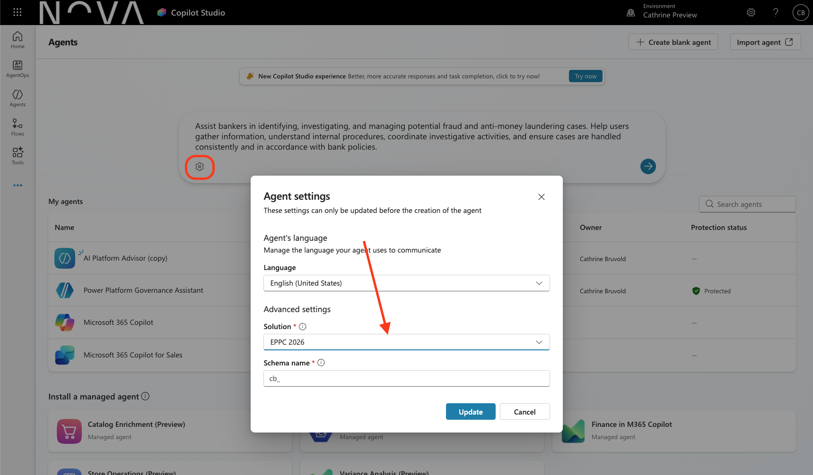
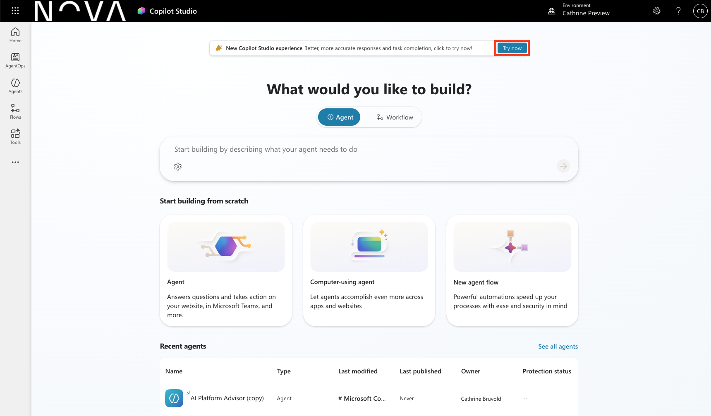

# Lab 2 – Creating an Agent

**Module 2 · Creating an agent from a prompt · ~15 min · 1 exercise**

## Objective

Create your first agent in Copilot Studio using a natural-language prompt, configure it inside a solution, and confirm your core authoring surfaces are ready for the exercises ahead.

## Prerequisites

- Lab 0 complete (Copilot Studio trial + developer environment): <https://copilotstudio.microsoft.com>
- Lab 1 complete (agent designed on paper): [Lab 1 – Designing an Agent for a Use Case](lab-01-agent-design.md)

---

### Exercise 2.1 – Create an agent from a prompt (15 min)

*Goal: create your first draft agent directly from a natural-language prompt inside a solution.*

1. Open Copilot Studio: <https://copilotstudio.microsoft.com>.
2. Create a solution before creating the agent:
   - Open **Solutions** by clicking on the three dots under **Tools** and selecting **Solutions**.
   - Select **+ New solution**.
   - Enter **Display name** (for example, `EPPC Agents` or `EPPC 2026`), then create and confirm **Publisher**.
   - Set as the **preferred solution** for your environment.
   - Select **Create**.
3. Navigate back to <https://copilotstudio.microsoft.com> and click the **settings wheel** to select your new solution.



4. Select **Create** and describe your agent using one of the prompts below, or use your own use case:

```text
Assist bankers in identifying, investigating, and managing potential fraud and anti-money laundering cases. Help users gather information, understand internal procedures, coordinate investigative activities, and ensure cases are handled consistently and in accordance with bank policies.
```

5. Click the **right arrow** to create the agent.
6. Confirm your core authoring surfaces are available for editing: **Instructions**, **Knowledge**, **Tools**, and **Model**.
7. Download the four knowledge documents from GitHub:
   - Open the repository in your browser, then go to `Assets/knowledge-sources`.
   - Open each file one by one, then click the **Download raw file** button (down-arrow icon near the top-right of the file view in GitHub).
   - If you do not see the download icon, use the **...** menu in the file toolbar and select **Download**.
   - Download all four files:
     - `Know Your Customer (KYC) and Customer Due Diligence Policy.pdf`
     - `Transaction Monitoring and Fraud Detection Framework.pdf`
     - `AML Risk Assessment and Customer Risk Scoring Guidelines.pdf`
     - `Suspicious Activity Reporting (SAR) and Quality Control Procedures.pdf`
8. Add the downloaded files as **Knowledge** sources in your newly created agent:
   - In the agent, open **Knowledge**.
   - Select **Add knowledge** (or **+ Add**) and upload each downloaded PDF.
   - Add all four files before continuing.

> Tip: You can use an LLM like Copilot or ChatGPT to summarize each file in 2-3 sentences, then use that summary as the description when adding each knowledge source.

**New UI equivalent (optional):** In Copilot Studio (<https://copilotstudio.microsoft.com>) → **New experience**, do the same setup on the **Build** tab. Note the agent is created without a prompt — you configure it directly on the Build tab.



✅ **Checkpoint:** you have a solution and an agent with all authoring surfaces accessible.

---

## Key concepts

Solution-first authoring · prompt-first agent creation · authoring surfaces (Instructions, Knowledge, Tools, Model) · Classic UI vs New UI Build tab.

## Success criteria

- [ ] Agent is created inside a solution (not the default environment).
- [ ] All four authoring surfaces — **Instructions**, **Knowledge**, **Tools**, **Model** — are visible and accessible.
- [ ] The four PDF files from `Assets/knowledge-sources` are added as **Knowledge** sources in the agent.
- [ ] I can locate the equivalent surfaces on the **New UI Build tab**.

➡ Next: **[Lab 3 – Instruction Tuning & Grounding](lab-03-instruction-tuning-grounding.md)** · See also **[Lab 8 – the same setup in the new UI](lab-07-old-vs-new-ui.md)**
